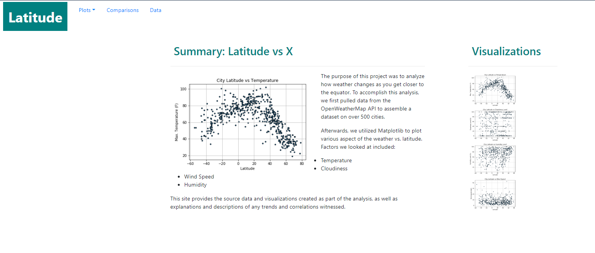

# Latitude vs X

Project Scope: 

This project was to show a simple dashboard made with Bootstrap and CSS.  

## Frameworks Utilized:

* HTML
* CSS
* Bootstrap

The visualizations contained inside are showing the impact of Latitude vs factors like Temperature, Cloudiness, Humidity, and Windspeed.

### Below is a sample screenshot of the dashboard:

## [Click here to view the Entire Dashboard](https://elzster.github.io/Weather-Dashboard/)

